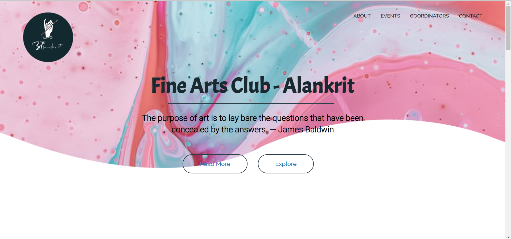

# IIITG-Finearts-Club (Alankrit)

This is the official website (webapp) of Fine-Arts club of IIITG (Alankrit). The site is to showcase the art works of students in various art events. 




### Description :
The website has different portions, the Recent Events Section displays the recent events held by the Club.\
The main frame is made using CSS keyframes and Bootstrap. \
To view the artworks made by the students one can click on the Artworks button below the Recent Events which takes the user to the instagram handel of Alankrit which is updated regularly with the artwork of students. \
The Coordinator section has the list past coordinators along their handels to contact them. \
The Contact Us sectoin is made using the smtplib module which provides a mail sending interface, a user can send any query using the contact us section. \
The current club coordinators can manage the site (add recent events, update coordinators) using the django admin panel. 


### Tech stack / Framework used : 
The backend of the webapp is made using Django Framework. For styling and ehancing the look Bootstrap , CSS and Javascript is used.

### Installation :

1. Create a virtual environment. You can use this [link](https://docs.python.org/3/library/venv.html) for reference.

2. Activate your virtual environment using : 
    
    ```env/Scripts/activate``` \
    
    Here env is the name of virtual environment.

3. Install all the requirements required to run the project : 
    
    ```pip install -r requirements.txt```

4. Run the project : 
    
    ```python manage.py runserver```

5. You can view the webapp by going to the [local host](http://127.0.0.1:8000/) on you web browser


### Contribute :
To contribute to the project Fork the repository, clone it on you local machine. Read the [guidelines](https://github.com/IIITG-Open-Source/Guidelines) before creating any pull request. 
Wait untill your pull request is acknowledged by the project maintainers.

### Contributors :
